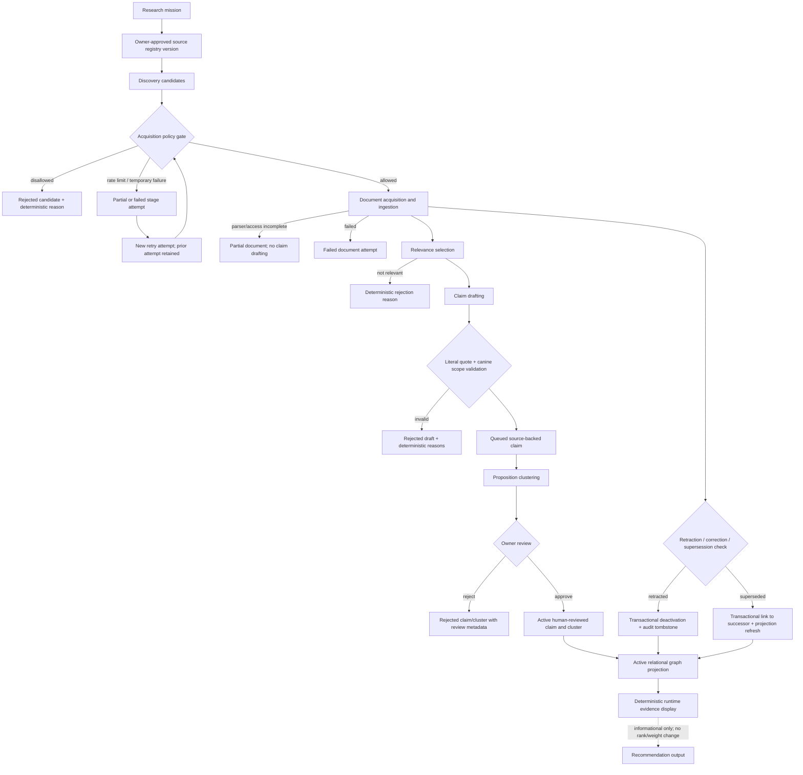

# Bowl Research Layer: Behive-informed architecture review

**Status:** P0, P1, and P2 released to production
**Reviewed:** 2026-08-01
**Behive implementation reviewed:** public commit [`c41ff5b2efcc7ddd056f493c2b2d44807b2d80fd`](https://github.com/qa10devteam/behive/tree/c41ff5b2efcc7ddd056f493c2b2d44807b2d80fd)
**Bowl baseline:** `9ce3be3c46b09709aac4f9561a2b363f2e8c63b3`

## Executive decision

Behive is useful as a pattern library, not as a Bowl dependency or authority. Bowl should adopt the idea of a durable parent mission, stage attempts, persisted progress events, per-stage model routing, a curated structured-source registry, and an evidence graph explorer. Each requires Bowl-specific controls for literal quotes, canine outcome scope, access policy, private-report isolation, human approval, independent study families, deterministic runtime, and zero ranking influence.

Bowl must reject Behive's crawler-evasion stack, numerical quality/confidence as truth, text/domain/graph-degree corroboration, and automatic promotion of generated claims into graph or synthesis paths. Neo4j, Qdrant, recurring missions, general web crawling, and user-facing graph presentation remain deferred.

The approved delivery order is:

1. parent mission lifecycle, stage attempts, and append-only persisted audit events;
2. immutable model-routing versions and an approved structured-source registry;
3. polling-based progress and cost UI, with optional SSE replaying the same event log;
4. active-only deterministic Postgres graph projection;
5. admin graph explorer with literal-quote drill-down;
6. retraction and supersession transaction validation;
7. recurring missions;
8. user-facing evidence map only after the reviewed graph is stable.

## Fixed Bowl boundary

A research claim is admissible only when a tested food exposure is tied to an outcome measured in dogs: clinical or biological response, digestibility, nutrient status, behaviour, or performance. Product contamination, antimicrobial resistance in products, manufacturing defects, recalls, label accuracy, undeclared species, category composition variability, and incidental ingredient mentions cannot become recommendation evidence.

Every retained claim must resolve to a literal source quote. Source access, document provenance, retraction state, and review metadata remain traceable. Draft or queued material cannot enter production evidence. Only active human-reviewed claims and clusters may be projected. Private dog reports never become global literature, uncertain report findings remain excluded, and accepted report findings apply only to that dog.

Evidence remains informational. Recommendation ranking stays deterministic, token-free, request-time-model-free, and unchanged by research.

## What the Behive code demonstrates

Behive has a mission row with status/phase fields and phase completion timestamps, but no normalized stage-attempt history ([schema](https://github.com/qa10devteam/behive/blob/c41ff5b2efcc7ddd056f493c2b2d44807b2d80fd/src/behive/init-db.sql#L8-L38)). Its orchestrator retries the whole pipeline after an unhandled failure and resets timings ([orchestrator](https://github.com/qa10devteam/behive/blob/c41ff5b2efcc7ddd056f493c2b2d44807b2d80fd/src/behive/engine/orchestrator.py#L1410-L1450)); resume infers checkpoints from accumulated row counts and mission fields rather than explicit successful attempts ([resume](https://github.com/qa10devteam/behive/blob/c41ff5b2efcc7ddd056f493c2b2d44807b2d80fd/src/behive/engine/orchestrator.py#L1988-L2053)). Synthesis failure can still mark a mission `done` with partial output ([graceful degradation](https://github.com/qa10devteam/behive/blob/c41ff5b2efcc7ddd056f493c2b2d44807b2d80fd/src/behive/engine/orchestrator.py#L1761-L1795)). Bowl needs explicit `partial`, failed-attempt retention, and idempotent retry identity.

Behive contains two progress mechanisms: the public server stores at most 500 events per mission in process memory ([server event buffer](https://github.com/qa10devteam/behive/blob/c41ff5b2efcc7ddd056f493c2b2d44807b2d80fd/src/behive/server.py#L131-L141)) and replays that buffer over SSE ([server SSE](https://github.com/qa10devteam/behive/blob/c41ff5b2efcc7ddd056f493c2b2d44807b2d80fd/src/behive/server.py#L340-L368)), while a separate module persists events and polls them for another SSE endpoint ([persisted events](https://github.com/qa10devteam/behive/blob/c41ff5b2efcc7ddd056f493c2b2d44807b2d80fd/src/behive/engine/events.py#L35-L57), [replay](https://github.com/qa10devteam/behive/blob/c41ff5b2efcc7ddd056f493c2b2d44807b2d80fd/src/behive/engine/events.py#L231-L268)). Bowl should have one persisted source of truth, with polling first.

Behive genuinely routes models by stage ([stage definitions](https://github.com/qa10devteam/behive/blob/c41ff5b2efcc7ddd056f493c2b2d44807b2d80fd/src/behive/config.py#L28-L50), [resolution precedence](https://github.com/qa10devteam/behive/blob/c41ff5b2efcc7ddd056f493c2b2d44807b2d80fd/src/behive/config.py#L164-L205)). Its model wrapper returns generated text and discards provider usage from the successful response ([completion path](https://github.com/qa10devteam/behive/blob/c41ff5b2efcc7ddd056f493c2b2d44807b2d80fd/src/behive/engine/llm.py#L132-L201)), so README cost estimates are not demonstrated as actual per-call accounting.

The structured-source idea is concrete: a JSON registry records endpoints, authentication, `use_when`, returned fields, and notes, while routing uses keyword and endpoint-description overlap ([registry contract](https://github.com/qa10devteam/behive/blob/c41ff5b2efcc7ddd056f493c2b2d44807b2d80fd/src/behive/engine/api_scout.py#L1-L18), [endpoint selection](https://github.com/qa10devteam/behive/blob/c41ff5b2efcc7ddd056f493c2b2d44807b2d80fd/src/behive/engine/api_scout.py#L128-L183), [acquisition](https://github.com/qa10devteam/behive/blob/c41ff5b2efcc7ddd056f493c2b2d44807b2d80fd/src/behive/engine/api_scout.py#L354-L420)). Bowl needs a much smaller veterinary registry with explicit licence, Terms, robots, rate, provenance, and admissibility policy versions.

The crawler implementation conflicts directly with Bowl. It advertises TLS impersonation and Jina/archive fallbacks ([drone layers](https://github.com/qa10devteam/behive/blob/c41ff5b2efcc7ddd056f493c2b2d44807b2d80fd/src/behive/engine/drones.py#L260-L273)); it detects robots restrictions but later escalates CAPTCHA, paywall, login-wall, and authentication failures to Jina or archives ([robots check](https://github.com/qa10devteam/behive/blob/c41ff5b2efcc7ddd056f493c2b2d44807b2d80fd/src/behive/engine/drones.py#L388-L409), [evasion fallbacks](https://github.com/qa10devteam/behive/blob/c41ff5b2efcc7ddd056f493c2b2d44807b2d80fd/src/behive/engine/drones.py#L688-L706)). Bowl must fail closed at an acquisition-policy gate.

Behive asks models to emit confidence and then applies writing-pattern quality thresholds before storing claims ([claim extraction and gate](https://github.com/qa10devteam/behive/blob/c41ff5b2efcc7ddd056f493c2b2d44807b2d80fd/src/behive/engine/process.py#L1015-L1088)). It upgrades confidence when fuzzy-similar claim text appears on two domains ([cross-domain upgrade](https://github.com/qa10devteam/behive/blob/c41ff5b2efcc7ddd056f493c2b2d44807b2d80fd/src/behive/engine/process.py#L1502-L1596)). That is not independent corroboration: mirrors, press releases, preprints, journal versions, reviews, and repeated study-family publications can inflate it.

Behive's graph paths admit claims using numeric thresholds, then extract entities to Neo4j ([Neo4j ingestion](https://github.com/qa10devteam/behive/blob/c41ff5b2efcc7ddd056f493c2b2d44807b2d80fd/src/behive/knowledge_graph.py#L231-L308)); another engine embeds eligible claims in Qdrant and synthesizes GraphRAG answers ([Qdrant indexing](https://github.com/qa10devteam/behive/blob/c41ff5b2efcc7ddd056f493c2b2d44807b2d80fd/src/behive/engine/graph_engine.py#L478-L560), [GraphRAG](https://github.com/qa10devteam/behive/blob/c41ff5b2efcc7ddd056f493c2b2d44807b2d80fd/src/behive/engine/graph_engine.py#L679-L755)). No human-reviewed active-only boundary is demonstrated on those paths.

No implemented retraction/supersession workflow, literature approval transaction, or recurring scheduler was found in the reviewed public commit. Tests heavily exercise functions and mocked paths, including event and orchestrator modules, but do not substantiate the README's stronger claims that synthesis cannot hallucinate, that paywall bypass is policy-safe, or that numerical confidence represents truth.

## Adopt / Adapt / Reject matrix

| Feature | What Behive implements | Benefit to Bowl | Conflict or risk | Decision | Recommended Bowl implementation | Priority |
|---|---|---|---|---|---|---|
| Mission state machine | Mission status and current phase on one row | One traceable parent for a bounded research intent | Phase history and partial outcomes are lossy | **Adapt** | `research_missions` with explicit queued/running/completed/partial/failed/cancelled states and deterministic terminal reasons | P0 |
| Stage orchestration | Sequential subprocess phases with mission-level retry | Clear operational decomposition | Whole-pipeline retry can duplicate work; partial synth may be called done | **Adapt** | Child stage attempts; retry creates a new linked attempt; idempotency key per attempt | P0 |
| Persisted progress events | A DB event implementation exists alongside process-memory SSE | Durable audit and replay | Two authorities can disagree; best-effort event failures lose history | **Adopt pattern** | One append-only Postgres event log; lifecycle transactions append events atomically | P0 |
| SSE | Public endpoint streams process-memory events | Responsive admin experience | Serverless restarts and multiple instances lose/diverge events | **Defer** | Poll persisted read model first; later SSE uses event sequence replay and polling fallback | P2/P3 |
| Stage-specific model routing | Config/env resolution by scout/harvest/process/synth | Right-size models and contain spend | Mutable env/config prevents reproducibility | **Adapt** | Immutable model-configuration version, prompt hash, provider/model, parameters and policy version attached to each stage | P1 |
| Token/cost/timing telemetry | Phase timing exists; README estimates cost; model wrapper returns text only | Budgeting and incident review | Estimates are not provider usage; retries obscure totals | **Adapt** | Persist actual provider usage per call plus separately labelled estimates; aggregate by stage and mission | P2 |
| Structured-source registry | Curated JSON endpoints with auth, notes, `use_when`, returns | Prefer structured authoritative sources over scraping | Generic registry lacks Bowl legal/access/admissibility controls | **Adapt** | Small versioned veterinary registry with owner approval, licence/ToS/robots/rate policy, provenance mapping and parser version | P1 |
| Source routing | Keyword/description overlap chooses APIs/endpoints | Deterministic first-pass routing | Relevance does not imply permission or evidence admissibility | **Adapt** | Separate discovery-question routing from acquisition policy and evidence-admissibility rules | P1 |
| Search-query generation | Model-generated research axes and precise queries | Better coverage of owner-approved questions | Generated premises can become prompt facts; generic breadth is costly | **Adapt** | Store generated queries as untrusted discovery artefacts; validate against mission scope and approved sources | P1 |
| Crawling/content acquisition | Multi-layer anti-bot, TLS impersonation, Jina, archives | May increase raw access | Directly violates Bowl's robots/ToS/paywall/CAPTCHA/licence boundary | **Reject** | Structured APIs, owner uploads, and explicitly approved fetch adapters only; deterministic fail-closed policy codes | — |
| Document extraction | Raw content and metadata stored with URLs/methods | Basis for provenance | Generic parsing/truncation may lose literal context and rights metadata | **Adapt** | Immutable source document version, access result, content hash, parser version, page/section offsets and retrieval metadata | P1 |
| Claim extraction/persistence | Models generate claims/confidence; thresholded rows are stored | Structured drafting assists reviewers | Model text can be prompt-generated and quote linkage is not enforced | **Adapt** | Draft only; exact contiguous quote plus deterministic canine-scope validation before queue; never active without owner transaction | Existing/P1 |
| Numerical quality scoring | Heuristic/model confidence and quality thresholds | Can flag malformed writing or missing fields | Writing quality is not truth, study strength or canine applicability | **Reject as evidence** | Use deterministic completeness/writing diagnostics only; never approve, rank, corroborate or project from the score | Existing guard |
| Claim deduplication | Fuzzy/text/entity matching and canonicalization | Reduces review noise | Similar wording can collapse distinct populations/exposures/outcomes | **Adapt** | Exact claim identity for idempotency; similarity only proposes merge; owner reviews proposition and study-family identity | P3/P4 |
| Corroboration | Similar claims from multiple domains receive confidence boost | Surfaces apparently repeated findings | Domains are not independent studies; mirrors and publication families inflate support | **Reject implementation** | Corroboration only from owner-reviewed independent study families; duplicates and related publications never count twice | P4/P5 |
| Graph storage | PostgreSQL, NetworkX, Neo4j and Qdrant have overlapping roles | Exploration can expose relationships | Multiple stores drift; numeric thresholds admit unreviewed claims | **Reject Behive stack** | Postgres relational projection from active reviewed rows only | P3 |
| Graph exploration | Neo4j/network/GraphRAG query paths | Useful admin navigation and quote drill-down | Graph degree and semantic proximity look authoritative | **Adapt/Defer** | Admin-only explorer; every edge displays relationship type, review state, study family and literal quote | P4 |
| Retraction/correction/deletion | No complete workflow found | Essential to safe evidence maintenance | Stale active projections can survive source correction | **Reject absence** | One transaction updates document/claims/clusters/projection and emits audit events; preserve tombstone/provenance | P5 |
| Synthesis | LLM drafts report from scored claims and graph context | Admin mission summary can help review | Fluent synthesis may introduce unsupported facts or imply approval | **Adapt** | Synthesis is a draft report over retained artefacts; every statement maps to claim IDs/quotes; never creates or activates evidence | P2/P4 |
| Human review | No Bowl-equivalent active-only owner approval boundary demonstrated | — | Automated scoring/graph insertion exceeds authority | **Reject implementation** | Preserve atomic owner review; no inferred literature approval; review metadata is mandatory for activation | Existing guard |
| Scheduled missions | No recurring scheduler demonstrated | Later freshness monitoring | Premature cost, duplication and unattended acquisition risk | **Defer** | Only after idempotency, budget caps, policy versions and retraction propagation are proven | P6 |
| Tests/advertised behaviour | Broad unit and mocked coverage | Useful implementation examples | Tests do not prove strongest marketing claims or policy compliance | **Adapt** | Acceptance tests assert state transitions, replay, retry idempotency, RLS, quote/scope guards, runtime isolation and projection eligibility | Every phase |

## Revised Bowl target architecture

### Mission lifecycle

`research_missions` is the parent record for one bounded owner-authorized research operation. It records the objective, mission type, requester, input, current stage, status, result summary, deterministic terminal reason, and timestamps. A completed discovery mission means discovery finished; it does not mean any candidate or claim was approved.

`research_ingestion_jobs` remains the executable compatibility unit. Existing rows remain untouched and have null mission links. New operations create the mission, first stage attempt, and job in one transaction. This avoids breaking existing documents and job audit links while establishing the new parent lifecycle.

### Stage lifecycle and retries

`research_mission_stages` stores attempts, not mutable phase slots. States are pending, running, succeeded, partial, failed, skipped, and cancelled. `(mission_id, stage_key, attempt_number)` is unique. A retry points to the earlier attempt and gets a new row; failed history is retained. Optional idempotency keys prevent duplicate mission/job creation from repeated requests.

The first slice maps current operations to one stage each:

| Current operation | Mission type | Initial stage |
|---|---|---|
| structured discovery | discovery | discovery |
| candidate or URL import | source_import | document_ingestion |
| uploaded PDF | document_processing | document_ingestion |
| document claim drafting | claim_drafting | claim_drafting |

Future orchestration may split acquisition, ingestion, relevance selection, drafting and clustering into separate attempts without replacing current job history.

### Audit events and transport

`research_mission_events` is append-only and ordered by a mission-local sequence. Lifecycle operations append events inside the same database transaction that changes mission, stage and job state. Events carry identifiers and bounded summaries, not source documents, private dog facts, prompts, secrets, or unrestricted model output.

Polling is canonical. Admin APIs return mission, stage and event read models ordered by the persisted sequence. Optional SSE may be added later only as replay of the same rows using `sequence_number`; it must reconnect through polling and cannot maintain a separate process-memory truth.

### Model-configuration versioning

Phase 2 introduces immutable configuration versions containing stage key, provider, exact model identifier, prompt/template hash, structured-output schema version, parameters, fallback policy and effective dates. Each stage attempt references one version. Environment defaults may choose a version, but cannot rewrite the historical meaning of an attempt.

### Structured-source registry and policy enforcement

Discovery questions and evidence admissibility are separate concepts:

- discovery asks where potentially relevant documents may exist;
- acquisition policy decides whether Bowl may access a source and by which adapter;
- evidence admissibility decides whether the acquired study tests a food exposure and measures a dog outcome.

The registry will be owner-reviewed and versioned. A source entry records authoritative identity, endpoint pattern, adapter/parser version, licence/terms/robots policy, authentication method, rate limits, allowed purposes, provenance mapping, and enabled state. Acquisition failures use deterministic codes such as `source_not_approved`, `robots_disallowed`, `terms_disallowed`, `licence_disallowed`, `paywall_or_login_required`, `captcha_or_access_control`, `rate_limited`, `unsupported_content`, and `parser_failed`. There is no bypass fallback.

### Provenance and review

Each document version keeps canonical source identity, literal retrieval URL, access status, content hash, retrieval time, parser version, extraction offsets and retraction/supersession state. Each claim resolves to a document version, chunk and exact quote. Deterministic scope and quote validation runs before a claim can be queued.

Owner review remains the only activation authority. Drafted or queued claims/clusters do not enter the active projection. Review decisions retain reviewer, timestamp, note, edited values and the model/source-policy versions that produced the draft. No owner literature approval is inferred from importing, viewing, selecting, editing, or running a mission.

### Relational graph projection

Postgres remains the system of record and graph store. The projection contains only active, human-reviewed, non-retracted, non-superseded claims and active clusters. Nodes/edges are relational views or tables with foreign keys back to claims, clusters, documents, literal quotes, applicability and reviewed study-family identities. Similarity, duplicate text and graph degree never create corroboration.

Neo4j and Qdrant are deferred. Bowl's initial graph is small, relationally constrained and quote-centric; another database would add drift and operational cost without improving authority.

### Retraction and supersession

A single transaction will:

1. mark the source document retracted, corrected or superseded;
2. transition affected active claims and clusters out of active eligibility;
3. update reviewed study-family/corroboration records;
4. refresh or invalidate the relational projection;
5. append audit events with actor, reason and affected identifiers;
6. leave tombstones and source history traceable.

Deletion is reserved for legally required removal or demonstrably unretained drafts, and it cannot silently erase audit meaning.

### Private-report separation

Research mission inputs, source artefacts, events and global graph rows cannot contain dog-report findings. Runtime may deterministically match active literature applicability to exact accepted findings for one dog. It does not copy those findings into literature, events or global graph nodes. Uncertain findings remain excluded.

### Usage and cost accounting

Each future model/source call records mission/stage IDs, provider request ID where available, model/config version, input/output tokens, billed/estimated cost with currency, elapsed time, retry number, status and bounded error code. Estimates and actual billed values are separate. Stage and mission totals are derived, not manually overwritten. Hard caps stop new calls and produce an explicit partial/failed state.

### Admin read models and runtime isolation

Admin read models expose recent missions, stage attempts, ordered events, usage totals, source-policy results, rejection reasons and provenance drill-down. Runtime recommendation endpoints do not query missions, stage attempts, events, pending documents, model configurations, source queues or embeddings. They continue to read only active reviewed evidence through the existing deterministic path, with zero contribution to ranking.

## Data flow

## Risk and threat assessment

| Threat | Failure mode | Required control | Acceptance evidence |
|---|---|---|---|
| Provenance loss | Claim cannot be traced to the exact accessed document and quote | Immutable document version, content hash, chunk/offset and parser/access metadata | Quote drill-down resolves every projected claim |
| False corroboration | Similar wording or multiple domains treated as independent support | Owner-reviewed study-family identity; no automated independence | Duplicate/mirror/preprint tests produce one family |
| Publication-family inflation | One study appears as preprint, abstract, paper, review or press release | Explicit related-publication links and canonical family | Family count, not URL/domain count, drives display |
| Prompt-generated facts | Model adds an unsupported premise or summary | Draft status, literal-quote validation, structured rejection reasons | Non-contiguous or absent quotes are rejected |
| Crawler-policy violation | Adapter bypasses robots, terms, paywall, CAPTCHA, licence or rate limit | Approved adapters and fail-closed policy gate; no generic fallback crawler | Policy fixtures assert deterministic rejection codes |
| Private-report leakage | Dog finding enters global mission/event/claim/graph data | Separate schemas/read paths; event payload allow-list | Tests scan mission payloads/projection for dog identifiers/findings |
| Draft enters production | Queued claim appears in graph/runtime | Active-only reviewed projection with database constraints | Queued/rejected fixtures never appear |
| Retraction propagation gap | Retracted evidence remains active or displayed | One deactivation/projection transaction | Rollback and end-to-end propagation tests |
| Retry duplication | Repeated request creates duplicate documents/claims/cost | Idempotency key, attempt lineage, exact document/claim identities | Same request key returns same job; retry has new attempt only |
| Model/config drift | Historical output cannot be reproduced or explained | Immutable configuration/prompt/schema version reference | Attempt record resolves exact config |
| Unbounded cost | Mission loops or retries indefinitely | Per-call/stage/mission caps and limited retry policy | Cap produces explicit partial/failed state with no further calls |
| Graph authority illusion | Dense/near nodes look more certain than evidence | Typed edges, quotes, review state, study family and warning copy | Explorer never labels degree/similarity as corroboration |

## Delivery plan and acceptance criteria

### P0 — mission lifecycle and audit events

- Add `research_missions`, `research_mission_stages`, and append-only `research_mission_events`.
- Add nullable mission/stage links to `research_ingestion_jobs`; do not backfill existing jobs.
- Create mission, stage and job atomically for new discovery, import, PDF and drafting operations.
- Preserve existing API job shapes and evidence behaviour.
- Expose authenticated admin polling read model.
- Prove RLS denies browser roles; retries cannot overwrite history; event sequence is replayable; runtime code has no dependency on mission tables.

### P1 — model routes and source registry

- Add immutable model/prompt/schema configuration versions.
- Add an owner-approved structured-source registry and versioned acquisition policy.
- Store generated queries as untrusted discovery artefacts.
- Acceptance: exact configuration and policy resolve from every attempt; disallowed access fails before acquisition.

### P2 — progress, usage and cost

- Store actual call usage/timing and separately labelled estimates.
- Build admin mission detail with polling; optional SSE only replays persisted events.
- Acceptance: reconnect resumes from sequence; totals equal call rows; caps halt calls deterministically.

### P3 — deterministic graph projection

- Create relational nodes/edges/views sourced only from active reviewed rows.
- Acceptance: queued/rejected/retracted/superseded/private rows are absent; ranking outputs remain byte-for-byte stable for fixtures.

### P4 — admin graph explorer

- Add claim/cluster/document/study-family navigation and literal-quote drill-down.
- Acceptance: every displayed edge resolves to review metadata and quote; similarity/degree are labelled navigation signals only.
- Status (2026-08-02): complete, locally implemented as one phase (see the
  P4 local implementation record below). `SAME_STUDY_FAMILY` now has a data
  model: automatic bibliographic-identity matching (author overlap, title
  similarity, publish-date proximity), per the owner's answers recorded
  below — not the text/domain claim-similarity mechanism this document
  rejects elsewhere, which is a different thing entirely.

### P5 — retraction and supersession validation

- Implement and test atomic propagation through claims, clusters, corroboration and projection.
- Acceptance: injected failure rolls back the entire change; successful propagation removes runtime eligibility immediately.

### P6 — recurring missions

- Add schedules only after idempotency, source policy and cost caps are proven.
- Acceptance: recurrence cannot overlap itself, exceed caps, bypass policy, or activate evidence.

### P7 — user-facing evidence map

- Consider only after the reviewed graph and correction lifecycle are stable.
- Acceptance: plain-language authority warnings, quote/source access, accessibility, mobile usability, and no ranking implication.

## Approval record and implementation boundary

The owner approved this architecture on 2026-08-01 with “this all looks good to me lets build it.” That approval authorizes the phased target and the tightly scoped P0 slice. It does not authorize applying migrations to production, installing Behive, adding crawlers/source registries/graph stores/recurring missions, changing evidence statuses, approving literature, changing food or dog data, altering ranking, or deploying.

The P0 local migration is `supabase/migrations/20260801204309_research_mission_lifecycle.sql`. It is accompanied by a shared lifecycle service, retry service operation, admin polling read model, and integration with the existing discovery/import/PDF/drafting job paths. The migration has been executed successfully against an isolated Postgres runtime, including terminal transitions, idempotent start/retry, retry lineage, event ordering, event immutability and service-role privileges. Production application remains a separate owner-reviewed release action.

### P0 release record

The owner subsequently approved the production release on 2026-08-01. Migration `20260801211409 research_mission_lifecycle` was applied to Supabase project `ysffyuohwvdifvbopfcm`, and application commit `51c20d8` was deployed to Vercel project `dog-food-helper` as deployment `dpl_7eRN3MwQJQk1Lz8tdDKHgb4WyrdZ`. Post-release checks confirmed the new tables and events were empty, protected research and private-report baselines were unchanged, the admin mission endpoint failed closed without authentication, and live recommendations remained deterministic with research excluded from ranking.

### P1 release record

The owner subsequently approved P1 on 2026-08-01. Production migration
`20260801221635 research_model_routing_and_literature_registry` pinned one
model-configuration set, seven stage configurations, eight exact routes, one
discovery-question policy, one evidence-admissibility policy, one literature
registry, two structured sources, two source versions, two source-policy
versions, and six source-policy routes. Application commit
`07ca6eae776469ee41eb71064573a0605cf435aa` was deployed to Vercel project
`dog-food-helper` as deployment `dpl_8aKEfQ5L8So59mo3mJD82vcvDAqx`.
Post-release checks confirmed zero missions/stages/events and unchanged
protected research, private-report, recommendation, food, and dog data.

### P2 local implementation and production gate

Candidate migration
`supabase/migrations/20260801223514_research_provider_usage_and_budget_caps.sql`
implements P2 without applying it to production. It adds:

- two immutable estimate-rate versions, with estimates explicitly distinct from
  actual provider/gateway-reported usage and cost;
- one immutable mission budget policy and seven immutable stage-cap rows;
- append-preserving provider-call rows linked to the exact mission, stage
  attempt, executable job, model-stage configuration, model route, and estimate
  rate;
- atomic pre-call reservation under deterministic mission, stage, elapsed,
  token, cost, and per-call caps;
- idempotent terminal completion, measured timing, retry-attempt history, and
  persisted `provider_call.*` / `budget.halted` events;
- stage/mission rollups that never substitute estimates for missing reported
  usage; and
- service-role-only functions, private RLS tables, database link invariants,
  immutable completed telemetry, and covering foreign-key indexes.

The application routes every current Voyage embedding and Claude drafting call
through that persisted reservation/completion path. The admin mission detail
read model and polling endpoint resume from `after_sequence`, page persisted
events, and expose attempts, routes, actual reported usage, separately labelled
estimates, timing, caps, and deterministic reasons. No SSE, crawler, graph
table/store, recurring mission, claim scoring, literature approval, evidence
activation, food/dog mutation, or recommendation-ranking change is included.

Validation used a disposable Supabase Postgres 17 database with the real P0,
real P1, and candidate P2 migrations applied in order. Database assertions
proved replay safety, no completed-call double count, deterministic pre-call
halt with prior history preserved, distinct retry attempts, exact links,
continuous event sequence, RLS/privileges, immutability, and indexed foreign
keys. Supabase `db lint --level warning --fail-on warning` returned no findings.
The full 296-test suite, TypeScript, optimized production build, and
`git diff --check` pass. The disposable database and local preview were removed.

### P2 production release record

The owner approved P2 for production on 2026-08-02. Exact application commit
`a27b75fcab6015456ba32f38cbd14845d68ee514` was pushed before database work.
The committed migration was verified as 54,922 bytes with SHA-256
`410b9a81694c3aa7dd0da329bc80e17cb8a3774152d30835b8b1f388fe7d697b`,
then applied to Supabase project `ysffyuohwvdifvbopfcm` as
`20260802065908 research_provider_usage_and_budget_caps`. It appears exactly
once in production history.

Production contains two usage-estimate rate versions, one mission budget-policy
version, seven stage-cap versions, and zero provider calls. Missions, stage
attempts, and mission events remain zero. RLS is enabled with no public policy
on all four P2 tables; anon/authenticated table and RPC access is absent;
service-role access is limited to the required reads, call insert/update, and
reservation/completion RPCs; completed calls and control versions are protected
by immutable/append-preserving triggers; exact restrictive foreign keys and
their covering indexes are present.

Every one of the 66 pre-existing public-table counts remained unchanged. The
protected baseline is 30 research documents, 695 chunks, 88 topic centroids,
2,282 document-relevance rows, 19 ingestion jobs, 22 cluster memberships, 12
applicability rows, 368 semantic embeddings, and zero research score-cache and
score-queue rows. Food, dog, private-report, evidence, recommendation, and
scoring counts were unchanged; all 30 saved recommendation items still have
zero research ranking contribution.

The immediate pre-release advisor baseline was 30 security findings (23 info,
5 warning, 2 error) and 82 performance findings (69 info, 13 warning). The
final result is 34 security findings (27 info, 5 warning, 2 error) and 91
performance findings (78 info, 13 warning). The complete delta is informational:
four deliberate private-table `RLS enabled, no policy` notices and nine unused
new-index notices. No P2 warning or error was introduced.

Vercel production deployment `dpl_2KzqWYAxMLa2A1u5DgEhh87Q9ZZv` reached
`READY`, and `https://dog-food-helper.vercel.app` resolves to it. The homepage
returned HTTP 200; unauthenticated mission/configuration endpoints returned
fail-closed HTTP 404 JSON. An existing authenticated owner session loaded the
admin research page at desktop and mobile widths with no horizontal overflow or
console errors. With the required zero-mission baseline, no paid call or mission
was created merely to populate attempts/events; persisted cursor polling,
separate actual/estimate presentation, timing/caps/halt UI, and the no-SSE
boundary remain covered by the released implementation and tests. The owner's
pre-existing 57-line `docs/research-brain-handoff-2026-07-29.md` edit was not
staged, committed, or included in the deployment.

### P3 local implementation (not yet production-gated)

Candidate migration
`supabase/migrations/20260802170000_research_graph_projection.sql`
implements P3 without applying it to production or committing it. It adds
nine read-only views only (`research_graph_documents`,
`research_graph_claims`, `research_graph_clusters`,
`research_graph_concept_nodes`, `research_graph_edges_derived_from`,
`research_graph_edges_member_of`, `research_graph_edges_direction`,
`research_graph_edges_concerns`, `research_graph_edges_applies_to`) —
`security_invoker`, no `anon`/`authenticated`/`PUBLIC` grant, `service_role`
`SELECT` only. Eligibility is enforced by the same rule everywhere: document
not retracted/not superseded/`canine_direct` scope, claim `status='active'`,
cluster `status='active'`. `SAME_STUDY_FAMILY` and `SUPERSEDES`/
`RETRACTED_BY` are explicitly not built (see BUILD_PROGRESS.md P3 entry for
why — no study-family identity exists yet, and supersession/retraction
propagation is P5's job, not P3's).

Validated in a disposable Supabase-image Postgres 17 container using a new
minimal fixture (`supabase/tests/p3_minimal_research_fixture.sql`,
reconstructing final-state schema the same way the existing
`p2_minimal_research_fixture.sql` does) plus assertions in
`supabase/tests/p3_graph_projection.sql`: exactly the eligible
document/claim/cluster/membership/applicability rows appear in every view;
every exclusion path (draft, rejected, queued, superseded-after-active-via-
join not just status, veterinary_methodology scope, queued cluster, rejected
cluster, neutral-direction cluster) is individually proven absent; no
ineligible concept value leaks into the concept-node union; grants are
exactly zero for anon/authenticated/PUBLIC and nine for service_role. The
migration was reapplied a second time with no error (idempotent). No
application code was touched, so ranking/recommendation output is unchanged
by construction; confirmed live with the full 296/296 test suite (including
the existing `recommendation retrieval does not depend on mission
control-plane tables` test), `tsc --noEmit`, and an optimized production
build, all clean. `git diff --check` is clean.

Per the same phase-gate pattern P0/P1/P2 each required, this stopped at local
implementation until the 2026-08-01 "build it" approval was followed by a
separate, explicit 2026-08-02 owner approval for commit, push, production
migration, and deployment.

### P3 production release record

The owner approved P3 for production on 2026-08-02. Exact application commit
`7b50c55643b6a17f1cede3d9a4e0dc98405f679c` was committed and pushed first.
The migration was applied to Supabase project `ysffyuohwvdifvbopfcm` as
`20260802161032 research_graph_projection`, appearing exactly once in
production history.

All nine `research_graph_*` views exist. Grants confirm zero
`anon`/`authenticated`/`PUBLIC` privileges on any of them; `postgres` and
`service_role` hold the normal owner/backend privilege set, the same pattern
every other table in this schema already uses. Protected counts are
unchanged: 30 documents, 695 chunks, 88 centroids, 2,282 relevance rows, 19
ingestion jobs, 22 cluster memberships, 12 applicability rows, 368
embeddings, 0 score-cache/queue rows, 0 missions, 0 provider calls.

Security and performance advisors are byte-identical to the pre-release
baseline — 34 security findings (27 info, 5 warning, 2 error) and 91
performance findings (78 info, 13 warning), with the finding list itself
unchanged, not just the totals. No `research_graph_*` finding of any kind
appears (confirmed by searching the full advisor payload). This migration
introduced zero new advisor findings, unlike P0/P1/P2, which each added a
small number of expected informational notices — nine read-only views over
existing tables give the linter nothing new to flag.

Application commit `7b50c55643b6a17f1cede3d9a4e0dc98405f679c` was deployed to
Vercel project `dog-food-helper` as deployment
`dpl_9j2vaUdgNKgnH9XBdUqQniunncbg`, target `production`, reaching `READY`;
`https://dog-food-helper.vercel.app` resolves to it. The homepage returned
HTTP 200. `/api/admin/research/missions` and
`/api/admin/research/configurations` (the existing P0/P1 admin endpoints —
P3 added no API route of its own) returned fail-closed HTTP 404 JSON
unauthenticated, matching every prior release. No application code changed
in this release, so this was a re-verification of existing behaviour, not a
new code path.

### P4 local implementation (complete, not yet committed)

P4 shipped as one complete phase, per the owner's explicit direction not to
split it into sub-phases: claim/cluster/document navigation, quote
drill-down, and study-family navigation all landed together below, not as
separate releases.

**Claim/cluster/document navigation and quote drill-down.** Required no
migration: the nine P3
`research_graph_*` views are already live in production and remain
`service_role`-only, so the first real work was an authenticated-admin API
path onto them, per the standing note that these views had zero UI/API
consumer. `src/app/api/admin/research/graph/route.ts` is `requireAdmin`-gated
(fail-closed 404) and queries the views plus
`research_evidence_cluster_members` (for `semantic_similarity` only) with the
service-role client, the same pattern `missions/route.ts` and
`claims/route.ts` already use.

`src/lib/researchGraphReadModel.ts` assembles nodes and edges so that every
displayed edge resolves to reviewer metadata and a literal quote, per the P4
acceptance criterion. `DERIVED_FROM`/`CONCERNS`/`MEMBER_OF` read their quote
directly off the claim endpoint. `SUPPORTS`/`CAUTIONS_AGAINST`/`APPLIES_TO`
have no claim endpoint of their own, so their quote is resolved from their
cluster's eligible member claims; when a cluster's only supporting claim has
since become ineligible (e.g. its document was retracted after the cluster
was approved), the edge is returned with `quote_unresolved: true` instead of
rendering as if fully evidenced. `navigation_degree` (edges touching a node)
and `semantic_similarity` are both present but explicitly and separately
labelled — the UI captions them "navigation hint only, not evidence
strength" and neither value feeds into how an edge's evidence is displayed.

`SUPERSEDES`/`RETRACTED_BY` are absent for a different, already-settled
reason: a retracted or superseded document has no node in this projection at
all, so there is nothing to attach a transition edge to before P5.

`src/components/ResearchGraphExplorer.tsx` is a read-only admin UI — search
and filter nodes by kind, select one to see its connected edges with
reviewer(s), literal quote(s) or the unresolved-quote warning, and any
similarity value. It approves, edits, and publishes nothing; that authority
remains with the existing `research_evidence_clusters` review action and
`edit_research_evidence_cluster` RPC. Wired into
`src/app/admin/research/page.tsx` after `ResearchKnowledgeAdmin`.

**Study-family navigation.** An earlier draft of this record split this out
into an invented "P4.5" sub-phase; the owner rejected that ("there shouldnt
be an item P4.5 youve invented that division in the build ... P'n' is a
whole section task, dont start breaking them apart") and asked the design
questions directly instead. The questions and the owner's answers, verbatim
where it matters:

1. *Linkage mechanism?* Owner: "Publish date and authors will be good to
   look at, as well as the obvious titles, matching authors wont publish
   multiple studies on the same date. I do not want to have to have to
   manually do this task, it should be achievable by the system somehow."
   Follow-up on whether an automatic match should still need a one-click
   human confirmation before counting as corroboration: **fully automatic,
   no human step.**
2. *When does detection run?* **At import**, before any claim drafting.
3. *How far does "same family" reach?* **Same paper, different forms only**
   (preprint, published version, press release, abstract) — explicitly not
   population overlap across distinct trials. Owner's own framing: "we never
   want to process the same study, thats pointless waste, but ... we should
   always bias full studies over partial ones."

This is why "fully automatic" is safe here in a way it would not be for
actual cross-study corroboration: matching two document *records* as the
same bibliographic identity (a preprint and its own later publication) is
the opposite of the "similar claim text across domains inflates confidence"
mechanism this document rejects elsewhere — it *prevents* a single study
from being double-counted, rather than inferring that two independent
studies agree. The one thing automation must never be allowed to touch is
already-reviewed evidence, so two invariants are enforced regardless of how
confident a match is: a document that already has claims drafted from it can
never be demoted or re-pointed (immutable once claims exist, matching every
other approved record in this schema), and every match is recorded and
displayed as exactly what it is — "automatically matched, not
human-reviewed" plus the concrete signals — never presented as if a reviewer
looked at it.

Implementation: migration
`supabase/migrations/20260802190000_research_document_study_family.sql`
adds `authors text[]`, `duplicate_of_document_id` (self-referencing FK, a
`before insert or update` trigger rejects chains so it always points
directly to a primary), `duplicate_match_basis jsonb`, and
`duplicate_detected_at` to `research_documents`, plus a tenth graph view,
`research_graph_edges_same_study_family` (same `security_invoker`/zero-grant
pattern as the original nine). `src/lib/researchStudyFamily.ts` holds the
pure matching decision (title similarity ≥0.92 alone, the same bar the
existing intra-batch discovery deduplication already uses; or ≥0.85 with at
least one shared author and publication years within 1 year) and the
fullness ranking (not abstract-only, not a preprint, better evidence grade)
that decides which side wins when neither has claims yet. `src/lib/researchEvidence.ts`'s
PubMed XML parser now extracts `<AuthorList>` into normalized surname/initial
strings (a matching signal only, never a byline) to feed this. Hooked into
the single shared insert path in `src/lib/researchBrainPipeline.ts`
(`storeDocumentWithVoyage`) so both the discovery-import and PDF-upload
routes get it automatically; PDF uploads have no structured authors and
degrade to the 0.92 title-only bar. `src/app/api/admin/research/processing/route.ts`
and `ResearchKnowledgeAdmin.tsx` now exclude documents flagged as duplicates
from "papers awaiting structured processing," with a visible count, so the
"don't process the same study twice" goal is real, not just a graph label.

**Verification gap closed (2026-08-02, later session).** The migration was
originally written without disposable-Postgres validation — the session that
built it had `docker ps` blocked outright by the environment's auto-mode
classifier. A later orientation session confirmed Docker was available
(`public.ecr.aws/supabase/postgres:17.6.1.143`, the same image the local
Supabase stack uses, already cached locally) and ran the same pattern P0-P3
used: `supabase/tests/p3_minimal_research_fixture.sql`, then the real
`20260802170000_research_graph_projection.sql`, then the real
`20260802190000_research_document_study_family.sql`, applied in order to a
disposable container, followed by a new
`supabase/tests/p4_study_family.sql` assertion suite. All assertions passed:
the chain-prevention trigger (`enforce_research_document_duplicate_target`)
rejects a duplicate pointing at another duplicate and rejects a nonexistent
target; the `research_documents_duplicate_not_self` check rejects
self-reference; `research_graph_edges_same_study_family` produces exactly
the expected edge and correctly excludes a duplicate whose primary target is
retracted (the primary never becomes an eligible `research_graph_documents`
node, so no edge is produced); `match_basis`/`detected_at` carry through
onto the edge; and grants are zero for `anon`/`authenticated`, exactly one
`service_role` SELECT. This migration is now implementation-validated the
same way P0-P3 were. It is still **not** applied to the connected production
Supabase project and still requires a separate, explicit owner approval for
that exact action — this closes the verification gap, not the release gate.

Verified live: `src/lib/__tests__/researchGraphReadModel.test.ts` (7 tests:
the original 6 covering quote/review resolution, unresolved-quote handling,
similarity labelling, and concept dedup, plus a new one asserting a
`SAME_STUDY_FAMILY` edge carries its match basis and zero reviews/quotes by
design, and a narrowed "no supersession edge" test now that
`SAME_STUDY_FAMILY` legitimately exists) and
`src/lib/__tests__/researchStudyFamily.test.ts` (6 new tests: the 0.92
title-only bar, the 0.85-with-authors-and-close-year bar, the below-0.85
no-match floor, fullness-based promotion, and — the one that matters most —
that a primary with existing claims is never demoted) plus the full suite:
309/309 passing, `tsc --noEmit` clean, optimized production build clean
(`/api/admin/research/graph` in the build output), `git diff --check`
clean. No ranking/recommendation code path was touched. The owner's
`docs/research-brain-handoff-2026-07-29.md` edit was not touched throughout.

P4 is complete as one phase. Per the same phase-gate pattern P0-P3 each
required, this stops at local implementation — commit, push, migration
application, and deployment all require a separate, explicit owner
approval. (The verification gap noted above this record was closed in a
later session — see the note higher in this section.)

## Research Layer P5 retraction and supersession propagation (2026-08-02, local implementation)

P5 is complete as one whole phase, implementing exactly the "Retraction and
supersession" design above (§"Revised Bowl target architecture") — the same
six-step transaction, plus the two graph edge types P3 explicitly deferred
here.

**The RPC**: `public.propagate_research_document_status_change` in
`supabase/migrations/20260802210000_research_retraction_supersession_propagation.sql`.
One `plpgsql` function (`security definer`, `set search_path = ''`,
`service_role`-only execute grant), so "injected failure rolls back the
entire change" is true by ordinary Postgres transaction semantics, not by
sequencing hope — the same reasoning this document uses elsewhere for why
every other atomic multi-table operation in this schema
(`research_mission_lifecycle` RPCs, `edit_research_evidence_cluster`, the P2
budget-cap reservation RPCs) is a single database function rather than
sequential JS calls.

`p_action` is `'retract'` (sets `retracted = true`) or `'supersede'` (sets
`superseded_by` to a required replacement document). "Corrected" is not a
third mechanism: the schema has only ever had these two columns, and a
correction is, mechanically, a document being superseded by its corrected
version — the audit event's `reason` text carries that distinction, not a
new enum value.

**Corroboration/study-family propagation** (the open design question this
document flagged for P4 not to have to answer): resolved by direct owner
decision, 2026-08-02 — when a study-family primary (P4's
`duplicate_of_document_id` target) is retracted or superseded, **the fullest
remaining non-retracted duplicate is auto-promoted to primary**, using the
identical fullness ranking `researchStudyFamily.ts` already uses at import
time, and every other duplicate is re-pointed to it. If every duplicate is
also retracted, the family is left explicitly orphaned
(`orphaned_duplicate_document_ids` on the audit event) rather than silently
dropped or guessed at. This was treated as a genuine product-policy fork, not
an implementation detail to infer — asked directly, answered directly, same
as every prior phase-shaping decision in this project.

**Cluster propagation is support-aware, not blanket**: a cluster only
transitions out of active eligibility when *none* of its member claims
remain active after the change. A cluster independently corroborated by a
second, unaffected document survives a retraction of the first; it
transitions only once its last remaining support is also retracted or
superseded. Verified as two explicit, separate test scenarios, not inferred
from one.

**A real ordering bug was caught, not just avoided**: the pre-existing
`research_document_sync_claim_metadata` trigger (from
`20260728200000_research_claims_and_grading.sql`, already in production)
fires synchronously the instant this function's own document-retraction
`UPDATE` runs — before the function's own explicit claim-transition step
gets to ask "which claims were active." Left in place, it would have
silently emptied `affected_claim_ids` on every retraction's audit event, and
it has no equivalent for the `superseded_by` path at all. This migration
retires that trigger and the now-fully-subsumed `mark_research_document_retracted`
function. The disposable-container validation was deliberately rebuilt with a
`supabase/tests/p5_pre_state_fixture.sql` reconstructing both retired
objects from their real source migration first, specifically so this
retirement — and the bug it fixes — was exercised against realistic pre-P5
state, not a container that never had the conflict to begin with.

**A real safety gap, found while wiring this in rather than invented as
scope**: `src/app/api/admin/research/[docId]/route.ts`'s `PATCH` allowed a
raw `superseded_by` field write with zero propagation of any kind. That path
is now closed; the sole way to retract or supersede a document is the new
`POST /api/admin/research/[docId]/lifecycle` route (owner-actor) or the
automated retraction-watch route (`system`-actor), both calling the one RPC.

**Projection**: two new views, `research_graph_edges_supersedes` and
`research_graph_edges_retracted_by`, exactly the pair
`20260802170000_research_graph_projection.sql` named as belonging here.
Both are necessarily asymmetric-eligibility tombstone edges — the
retracted/superseded side is by definition never itself an eligible
`research_graph_documents` node, unlike P4's `SAME_STUDY_FAMILY`, which
requires both endpoints to already be eligible. `SUPERSEDES` points the
still-live replacement document back at the tombstoned old one;
`RETRACTED_BY` (no replacement exists for a pure retraction) terminates at
the audit event instead, via a new `event` node kind in the read model. This
is a graph-presentation decision, not a product-policy one, so it was made
and disclosed rather than escalated — same standard this document applies
elsewhere to reversible technical calls. `ResearchGraphExplorer.tsx` renders
the tombstoned side visibly dimmed and labelled, not as a dangling edge
endpoint. Existing `research_graph_*` views need no separate refresh step —
they are live selects over the same tables this RPC updates, verified
directly (the P4/P5 disposable-container tests query them after the RPC
runs) rather than assumed from "views are live" alone.

**Deliberately out of scope**: P6 (recurring missions), P7 (user-facing
evidence map), any change to ranking/recommendation logic beyond what
`activeClaimRetrieval.ts` already excluded via its existing
`document.retracted`/`document.superseded_by` join checks (P5 adds explicit
claim/cluster status transitions and an audit trail on top of that existing
exclusion, it does not change what was already excluded). No original
source, claim, or cluster row is ever deleted. A second, much older raw
`superseded_by` write in `src/lib/embeddingPipeline.ts` (`ingestResearchDocument`,
belonging to the original 6-phase build plan's "Phase 4: RAG research layer"
— a different, earlier subsystem with no `research_claims`/
`research_evidence_clusters` involvement) was noticed and deliberately left
alone as a separately-scoped concern, not silently ignored.

Validated in a disposable `public.ecr.aws/supabase/postgres:17.6.1.143`
container: P3 fixture → P3 migration → P4 migration → a new
`supabase/tests/p5_pre_state_fixture.sql` (reconstructing the two retired
pre-P5 objects) → this P5 migration → `supabase/tests/p5_retraction_supersession.sql`.
Six scenarios: plain retraction; a cluster surviving partial retraction then
transitioning once its last support is also retracted; supersession
(including rejecting an already-retracted replacement target);
study-family auto-promotion; orphaning when every duplicate is also
retracted; and the acceptance-critical **injected mid-transaction failure**
— a temporary trigger raising on a sentinel cluster positioned after the
document and claim updates already ran, asserting all of it rolled back
(document, claims, cluster, and no audit event inserted), then a clean retry
after removing the injected failure succeeds normally. Plus append-only
grant assertions. All passed.

Verified live: `src/lib/__tests__/researchGraphReadModel.test.ts`'s old "no
supersession edge type is ever produced" placeholder test replaced 1-for-1
with real `SUPERSEDES`/`RETRACTED_BY` assertions (tombstone nodes resolve,
not dangling ids) now that P5 exists — full suite still 309/309, `tsc
--noEmit` clean, optimized production build clean
(`/api/admin/research/[docId]/lifecycle` in the build output), `git diff
--check` clean. No ranking/recommendation code path was touched. The
owner's `docs/research-brain-handoff-2026-07-29.md` edit was not touched
throughout.

P5 is complete as one phase. Per the same phase-gate pattern every prior
phase required, this stops at local implementation — commit, push, migration
application, and deployment all require a separate, explicit owner
approval.
